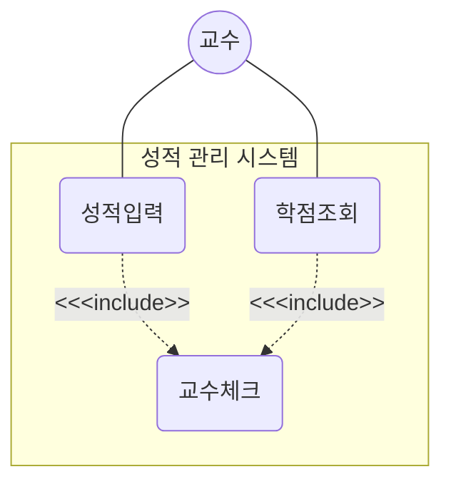

```mermaid

graph TD
    Professor((교수))

    subgraph "성적 관리 시스템"
        UC1(성적입력)
        UC2(학점조회)
        UC3(교수체크)
    end

    Professor --- UC1
    Professor --- UC2

    UC1 -.->|"<<&ltinclude>>"| UC3
    UC2 -.->|"<<&ltinclude>>"| UC3
```
