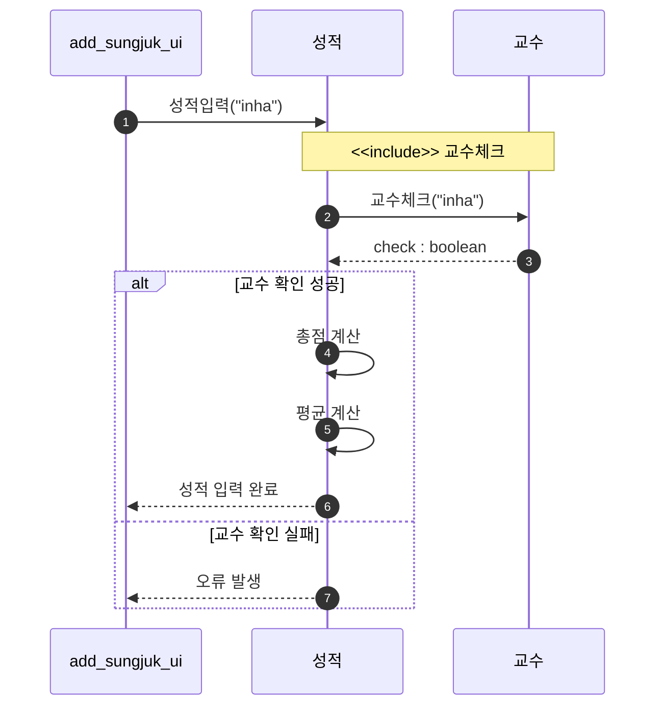

```mermaid
sequenceDiagram
    autonumber
    participant add_sungjuk_ui
    participant 성적
    participant 교수

    add_sungjuk_ui->>성적: 성적입력("inha")
    Note over 성적,교수: <<include>> 교수체크
    성적->>교수: 교수체크("inha")
    교수-->>성적: check : boolean

    alt 교수 확인 성공
        성적->>성적: 총점 계산
        성적->>성적: 평균 계산
        성적-->>add_sungjuk_ui: 성적 입력 완료
    else 교수 확인 실패
        성적-->>add_sungjuk_ui: 오류 발생
    end
```
